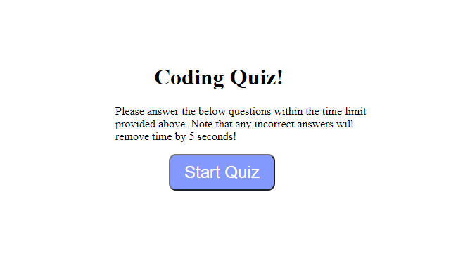

# Coding-Quiz

This Coding quiz was made by myself (Brandon Conte) to show my skills in all 3 elements of HTML, CSS, and Javascript. 

This quiz will take you through a series of questions, if answered correctly you get points. If answered incorrectly, you have time taken off your time left (a penalty).
At the end of the quiz you will be able to put your initials and have your highscore be shown on the board.
There will also be a button there to wipe or clear your highscores.

* [Github Repo](https://github.com/BrandonConte/Coding-Quiz/settings)
* [Deployed Website](https://brandonconte.github.io/Coding-Quiz/)

